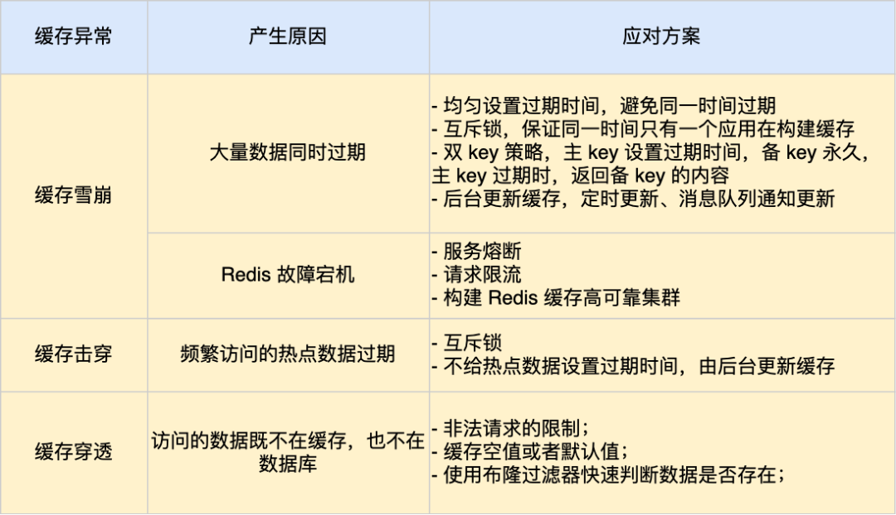

# Redis

## Redis数据结构

+ 5种基础数据结构
  + String字符串
  + List列表
  + Set集合
  + Hash散列
  + Zset有序集合

+ 3种特殊数据结构
  + HyperLogLogs基数统计
  + Bitmap位存储
  + Geospatial地理位置

## `Redis`提供6种数据淘汰策略

1. `volatile-lru`（least recently used）：从已设置过期时间的数据集（server.db[i].expires）中挑选最近最少使用的数据淘汰
2. `volatile-ttl`：从已设置过期时间的数据集（server.db[i].expires）中挑选将要过期的数据淘汰
3. `volatile-random`：从已设置过期时间的数据集（server.db[i].expires）中任意选择数据淘汰
4. `allkeys-lru`（least recently used）：当内存不足以容纳新写入数据时，在键空间中，移除最近最少使用的 key（这个是最常用的）
5. `allkeys-random`：从数据集（server.db[i].dict）中任意选择数据淘汰
6. `no-eviction`：禁止驱逐数据，也就是说当内存不足以容纳新写入数据时，新写入操作会报错。这个应该没人使用吧！
4.0 版本后增加以下两种:
7. `volatile-lfu`（least frequently used）：从已设置过期时间的数据集（server.db[i].expires）中挑选最不经常使用的数据淘汰
8. `allkeys-lfu`（least frequently used）：当内存不足以容纳新写入数据时，在键空间中，移除最不经常使用的 key

### Redis持久化机制

1. RDB快照
2. AOF只追加文件

## `Redis` 缓存击穿、穿透、雪崩等场景的处理方式

## 如何保证 redis 缓存一致性？

### 方案一

#### 采用延时双删策略

+ 基本思路： 在写库前后都进行删除缓存操作，并且设置合理的超时时间
+ 基本步骤： 先删除缓存–再写数据库—休眠一段时间—再次删除缓存
  注：休眠的时间是根据自己的项目的读数据业务逻辑的耗时来确定的。这样做主要是为了保证在写请求之前确保读请求结束，写请求可以删除读请求造成的缓存脏数据。
+ 该方案的弊端： 集合双删策略+缓存超时策略设置，这样最差的结果就是在超时时间内数据存在不一致，又增加了写请求的耗时。

### 方案二

#### 一步更新缓存（基于订阅Binlog的同步机制）

+ 基本思路： `MySQL Binlog`增强订阅消费 + 消息队列 + 增量数据更新到`Redis`。
