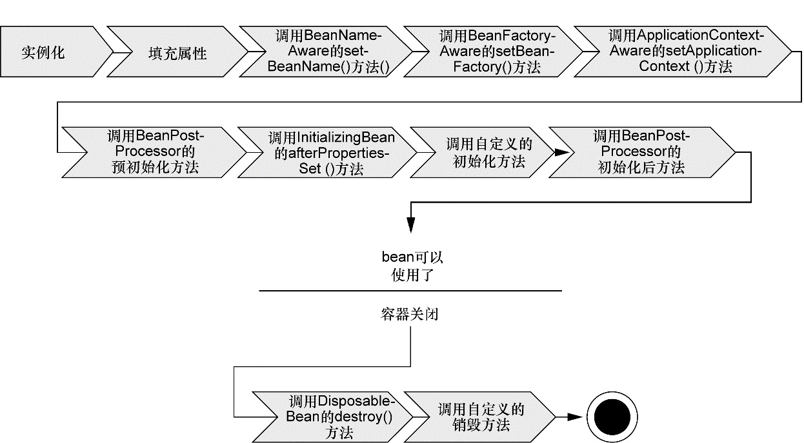

# Bean的生命周期

## 一、流程图

## 二、启动步骤

+ 1、Spring对bean进行实例化；
+ 2、Spring 将值和 bean 的引用注入到 bean 对应的属性中；
+ 3、如果 bean 实现了 BeanNameAware 接口，Spring 将 bean 的 ID 传递给 setBeanName()方法；
+ 4、如果 bean 实现了 BeanFactoryAware 接口，Spring 将调用  setBeanFactory() 方法，将 BeanFactory 容器实例传入；
+ 5、如果 bean 实现了 ApplicationContextAware 接口，Spring 将调用 setApplicationContext() 方法，将 bean 所在的应用上下文的引用传入进来；
+ 6、如果 bean 实现了 BeanPostProcessor 接口，Spring 将调用它们的 postProcessBefore-Initialization() 方法；
+ 7、如果 bean 实现了 InitializingBean 接口，Spring 将调用它们的 afterPropertiesSet() 方法。类似地，如果 bean 使用 initmethod 声明了初始化方法，该方法也会被调用；
+ 8、如果 bean 实现了 BeanPostProcessor 接口，Spring 将调用它们的 postProcessAfter-Initialization() 方法；
+ 9、此时，bean 已经准备就绪，可以被应用程序使用了，它们将一直驻留在应用上下文中，直到该应用上下文被销毁；
+ 10、如果 bean 实现了 DisposableBean 接口，Spring 将调用它的 destroy() 接口方法。
